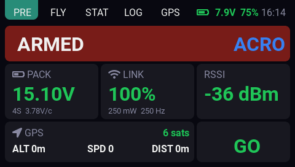
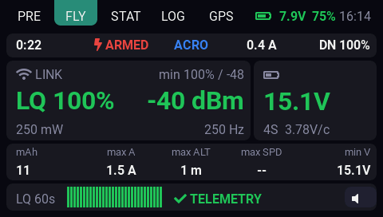
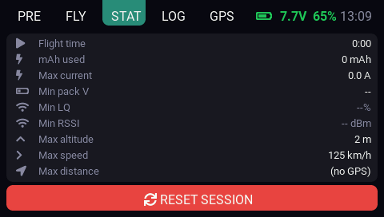
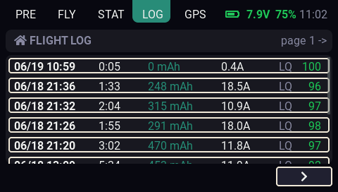
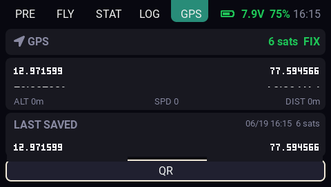
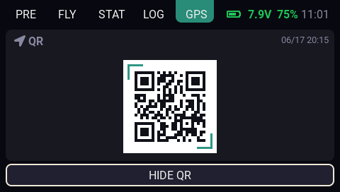

# EdgeDeck

<p align="center">
  <a href="https://github.com/ehpankaj"></a>
  <a href="https://www.instagram.com/4bit_loop/"></a>
  <a href="https://www.youtube.com/@4bit_loop"></a>
  <a href="https://github.com/ehpankaj/radiomaster-edgetx-ui/issues"></a>
  <a href="https://github.com/ehpankaj/radiomaster-edgetx-ui/releases"></a>
  <a href="LICENSE"></a>
</p>

<p align="center">
  <a href="https://github.com/ehpankaj">GitHub</a> ·
  <a href="https://www.instagram.com/4bit_loop/">Instagram</a> ·
  <a href="https://www.youtube.com/@4bit_loop">YouTube</a> ·
  <a href="https://github.com/ehpankaj/radiomaster-edgetx-ui/issues">Issues</a> ·
  <a href="https://github.com/ehpankaj/radiomaster-edgetx-ui/releases">Releases</a> ·
  <a href="CHANGELOG.md">Changelog</a> ·
  <a href="CONTRIBUTING.md">Contributing</a> ·
  <a href="SECURITY.md">Security</a>
</p>

EdgeDeck is a full-screen FPV telemetry dashboard and session logger for a
RadioMaster TX16S-style 480x272 color screen, EdgeTX, ExpressLRS, and Betaflight.

The goal is simple: make drone state easy to check on the radio before launch,
between packs, or after landing without putting goggles back on or digging
through EdgeTX telemetry pages. During FPV flight the pilot is usually in
goggles, so EdgeDeck treats haptic, sound, and optional voice alerts as the
important in-flight path, while the screen stays useful for quick glances,
pre-flight checks, recovery, and session review.

EdgeDeck also saves per-pack logs so the pilot can review how the place behaved
after a session: link quality and RSSI lows, TX power, packet rate, battery
usage, current, GPS-derived stats, and other telemetry that helps judge range
and reliability for that location.

## Screenshots

| PRE | FLY |
| --- | --- |
|  |  |
| STAT | LOG |
|  |  |
| GPS | GPS QR |
|  |  |

GPS screenshots use sample or masked coordinates so the README does not publish
real flight locations.

## What It Shows

EdgeDeck has five tabs:

| Tab | Purpose |
| --- | --- |
| PRE | Pre-flight view with arm state, mode, pack voltage, link status, RSSI, GPS, and a GO/CHECK readiness indicator. |
| FLY | Live telemetry dashboard for quick radio checks, with timer, mode, LQ, RSSI, pack voltage, current, mAh, GPS stats, alert state, and a 60-second LQ history graph. |
| STAT | Current pack/session summary: flight time, mAh used, max current, min pack voltage, min LQ/RSSI, max altitude, speed, and distance. |
| LOG | Saved per-pack session history, with a detail view for each recorded battery session. |
| GPS | Live and last-saved coordinates, plus a scannable QR code for the last saved position. |

In smaller widget zones, EdgeDeck falls back to a compact focus view that keeps
the most important telemetry visible.

## Features

- Color-coded LQ, RSSI, pack voltage, TX battery, and alert states.
- Configurable warning and critical limits for LQ, RSSI, and per-cell pack voltage.
- Haptic and sound alerts: 2 pulses for warning, 4 pulses for critical alerts.
- Optional voice callouts for link quality and pack voltage alerts.
- Mute button for quickly silencing alerts during a flight.
- Current pack/session stats: flight time, mAh used, max current, min pack voltage, min LQ/RSSI, max altitude, max speed, and max distance.
- Per-pack session logging to the SD card for post-session range and reliability review.
- Focus/compact mode for smaller screen zones.
- GPS telemetry support for satellites, altitude, ground speed, distance, coordinates, and QR sharing.
- Auto tab switching: PRE on connect, FLY on arm, STAT after link loss.
- Touch and rotary support for tabs, log navigation, and session reset.

## Requirements

- EdgeTX 2.11 or newer.
- A color-screen EdgeTX RadioMaster TX16S.
- ExpressLRS transmitter module and receiver with telemetry enabled.
- Betaflight sending CRSF telemetry.
- Sensors discovered on radio.

## Install

1. Open the radio SD card using USB storage mode or a card reader.
2. Copy the `EdgeDeck` folder from this repository into the SD card's
   `/WIDGETS/` folder.
3. The final radio SD-card path should look like this:

   ```text
   /WIDGETS/EdgeDeck/main.lua
   /WIDGETS/EdgeDeck/qrgen.lua
   ```

4. Reinsert the SD card or exit USB storage mode.
5. On the radio, long-press a screen.
6. Choose **Edit**.
7. Tap an empty widget zone.
8. Select **EdgeDeck**.
9. For the full dashboard, use it as a full-screen widget.

If the widget is placed in a small zone, it will automatically use the compact
focus layout.

For upgrades, copy the repository's `EdgeDeck` folder over
`/WIDGETS/EdgeDeck/`. Runtime files such as `sessions.log` and `gps_last.txt`
can be left in place.

Only the `EdgeDeck` folder is needed on the radio. Repository files such as
`README.md`, `examples/`, and `.github/` are for development and do not need to
be copied to the SD card.

## Telemetry Setup

On the radio, power the model and run:

```text
Model Setup -> Telemetry -> Discover new sensors
```

EdgeDeck reads common CRSF/ELRS telemetry sensors:

| Data | Sensor names |
| --- | --- |
| Uplink LQ | `RQly` |
| RSSI | `1RSS`, `2RSS`, or `RSSI` |
| TX power | `TPWR` |
| Packet rate | `RFMD` |
| Current | `Curr` |
| mAh used | `Capa` |
| Pack voltage | `RxBt` |
| Flight mode / arm state | `FM` |
| GPS satellites | `Sats`, `Sat`, or `GPS Sats` |
| GPS coordinates | `GPS` or Lat/Lon variants |
| GPS altitude | `GAlt` or `Alt` |
| GPS speed | `GSpd`, `Gspd`, or `GPS Speed` |
| GPS distance | `Dist` or `GPS Dist` |

Missing sensors are handled gracefully. The widget will show `--` or `0` instead
of crashing. More discovered sensors make the dashboard richer.

## Betaflight Flight Mode Sensor

For Betaflight, native CRSF telemetry is recommended so the radio receives the
`FM` sensor:

```text
set crsf_telemetry_mode = NATIVE
save
```

After the flight controller reboots, discover sensors again on the radio.

EdgeDeck uses `FM` to detect armed/disarmed state and show the current mode. If
`FM` is unavailable, it falls back to current draw and treats the craft as armed
when current rises above 1 A.

## Widget Options

Open the widget settings from the radio to tune the main behavior:

| Option | Default | Meaning |
| --- | ---: | --- |
| `AccentColor` | theme | Active tab and highlight color. |
| `LQ_Warn` | 80 | LQ percentage at or below this value turns yellow. |
| `LQ_Crit` | 50 | LQ percentage at or below this value turns red. |
| `RSSI_Warn` | -98 | RSSI dBm warning threshold. |
| `RSSI_Crit` | -103 | RSSI dBm critical threshold. |
| `CellV_Warn` | 350 | Per-cell pack warning voltage in centivolts. `350` means 3.50 V. |
| `CellV_Crit` | 330 | Per-cell pack critical voltage in centivolts. `330` means 3.30 V. |
| `Audio` | 2 | `0` silent, `1` haptic/beep alerts, `2` haptic/beep plus voice callouts. |
| `AutoTab` | 0 | `1` enables automatic tab switching, `0` keeps tabs manual. |

EdgeTX numeric widget options are integers, so pack-voltage thresholds are entered
in centivolts.

The default LQ warning matches Betaflight's link-quality OSD alarm default. The
default RSSI values target ExpressLRS 2.4 GHz 250Hz LoRa, where RFMD 27 has a
-108 dBm sensitivity limit; the defaults place warning/critical alerts 10 dB and
5 dB above that limit. The default pack-voltage values match Betaflight's
per-cell warning and minimum-voltage defaults.

## Alerts

Live values change color immediately when they cross configured warning or
critical limits. Audible and haptic alerts wait briefly before firing, which helps
avoid alerts from tiny RF or voltage dips.

Alert behavior:

- Warning: 2 haptic/tone pulses.
- Critical: 4 haptic/tone pulses.
- Critical alerts repeat faster than warnings.
- Multiple critical alerts repeat faster still.
- `Audio = 2` also enables voice callouts for LQ and pack voltage.
- The FLY tab mute button silences alerts for 30 seconds.

The widget alerts on link quality, RSSI, pack voltage, TX battery, and telemetry
loss while armed.

## Session Logs

EdgeDeck saves one log entry per battery session. A session starts on the first
arm after a battery is connected and ends when the battery is swapped, telemetry
is lost long enough, or the session is otherwise finalized after disarm.

Logged data includes:

- Flight duration.
- mAh used.
- Minimum LQ and RSSI.
- Minimum pack voltage.
- Maximum current.
- Maximum GPS altitude, speed, and distance.
- First-arm GPS latitude and longitude, when a coordinate fix is available.
- Maximum TX power.
- Packet rate.

The LOG tab keeps the newest sessions available on the radio. Up to 100 entries
are retained by default; this limit is set in the `CFG.logging` section near the
top of `EdgeDeck/main.lua`.

These logs are meant to be useful after flying. After a pack or at the end of the day, the pilot can
open LOG and compare signal lows, packet rate, TX power, battery sag, current,
and GPS-derived stats to understand how range and link behavior felt in that
particular place.

Runtime log files can contain private flight history. `sessions.log` is ignored
for new clones; sanitized format examples are available in `examples/`.

## GPS Coordinates

The GPS tab shows live coordinates and saves the latest valid position about
every 2 seconds while coordinate telemetry is available. The last saved position
is kept in a small SD-card file separate from the flight log and can be shown as
a QR code from the GPS tab.

The QR code is generated on demand from the last saved coordinate. It stays fixed
while displayed, even if newer coordinates are saved in the background, and is
rebuilt the next time the QR view is opened.

## Battery Notes

Drone pack status is based on per-cell voltage calculated from `RxBt`. The widget
auto-detects the cell count from the pack voltage and uses configured
warning and critical limits for coloring and alerts.

The radio TX battery display uses the radio's configured battery warning and
range settings. TX warning follows **Radio Settings -> Battery range** warning;
TX critical is derived as 0.10 V/cell below that warning. The percentage still
uses the configured min/max range and the Li-Ion curve in `CFG.battery`.

## Contributing

Contributions are welcome. Start with `CONTRIBUTING.md` for local checks, radio
testing notes, and project conventions. User-visible behavior changes should also
update `CHANGELOG.md`.

Please avoid committing runtime files from the radio SD card, especially
`sessions.log` and `gps_last.txt`, because they can contain flight history and
coordinates.

## Troubleshooting

| Problem | What to check |
| --- | --- |
| Blank screen or EdgeTX warning | Make sure the radio is on EdgeTX 2.11 or newer. |
| Values show `--` or `0` | Discover telemetry sensors with the model powered on. |
| Arm state is wrong | Enable native CRSF telemetry and rediscover the `FM` sensor. |
| GPS fields are empty | Confirm GPS telemetry is present and sensors such as `GPS`, `Sats`, `Alt`, `GSpd`, and `Dist` exist. |
| QR does not build | Confirm `EdgeDeck/qrgen.lua` is installed beside `EdgeDeck/main.lua`, then reload the widget. |
| Alerts are too noisy | Lower `Audio`, adjust thresholds, or use the mute button during flight. |
| Full dashboard does not appear | Place the widget in a full-screen zone. |

## More Detail

For implementation details, see `README_technical.md`. It covers sensor behavior,
logging details, customization notes, and other maintainer-facing context.

## License

EdgeDeck is released under the MIT License. See `LICENSE` for details.
